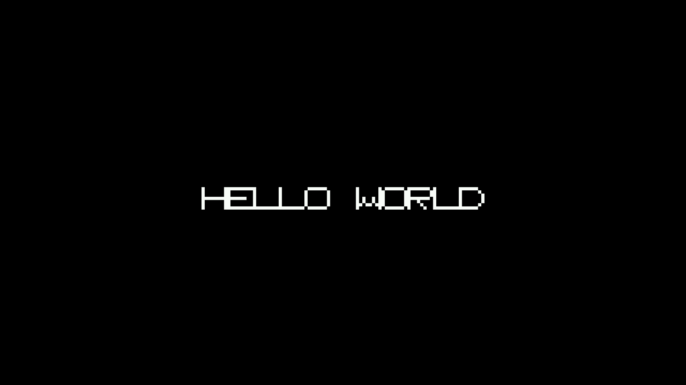

# Hello World (Dreamcast)

A minimal, from-scratch bare-metal Sega Dreamcast program (no KallistiOS,
no BIOS calls). It talks directly to the PowerVR2 (PVR) display hardware
to bring up a 320x240 RGB565 framebuffer, then plots "HELLO WORLD" into
it with a hand-drawn 8x8 font (the same glyph bitmaps used in the
companion `hello-world-snes` project) and halts.



Verified running in [Flycast](https://github.com/flyinghead/flycast),
built from source and booted headless via `tools/run_flycast_headless.sh`
— the screenshot above is straight from that run, loaded as a homebrew
`.elf` (Flycast auto-enables its from-scratch `reios` HLE BIOS for `.elf`
files, so no copyrighted Sega BIOS is needed to boot or test this).

## Layout

- `src/start.S` — the SH4 entry point: disables interrupts, sets up a
  stack pointer at the top of main RAM, and jumps into C.
- `src/hello.c` — PVR2 register setup (mirrors KallistiOS's `vid_init()`
  for its `DM_320x240_NTSC` mode — see `video.c` in
  [KallistiOS](https://github.com/KallistiOS/KallistiOS), which this was
  checked against), a framebuffer clear, the font data, and the draw
  loop.
- `dc.ld` — linker script placing code at `0x8c010000` (the conventional
  homebrew load address in the Dreamcast's 16MB main RAM).
- `Makefile` — builds `hello.elf` with `sh-elf-gcc`/binutils.

## Building

Requires an `sh-elf` cross toolchain (Ubuntu/Debian ship one):

```sh
sudo apt-get install gcc-sh-elf binutils-sh-elf libnewlib-sh-elf-dev
make
```

This produces `hello.elf`.

## Running

- **Flycast** (or another Dreamcast emulator with homebrew ELF support):
  load `hello.elf` directly.
- **Real hardware**: load `hello.elf` over a serial/broadband adapter with
  [dcload](https://github.com/dcload-ip/dcload-ip)/`dc-tool`, or convert
  it to a bootable disc image with this repo's existing `mkdcdisc`
  pipeline (see `docker/README.md`) if you want a `.cdi`.

## How it works

- `_start` (in `start.S`) disables interrupts, sets SR to a known value,
  points the stack at the top of the standard 16MB Dreamcast RAM window
  (`0x8cfffff0`), and calls `main()`.
- `video_init()` configures the PVR2's scan-out registers directly
  (pixel format, line stride, framebuffer address/size, timing) for a
  320x240, non-interlaced, RGB565 mode — no 3D/tile-accelerator setup is
  needed since this only ever writes a flat framebuffer.
- The framebuffer (at the start of VRAM, `0xa5000000`) is cleared to
  black, then "HELLO WORLD" is plotted into it, glyph by glyph, at 3x
  scale, centered on screen.
- `main()` never returns; it spins forever once the frame is drawn, since
  nothing else needs to happen.
