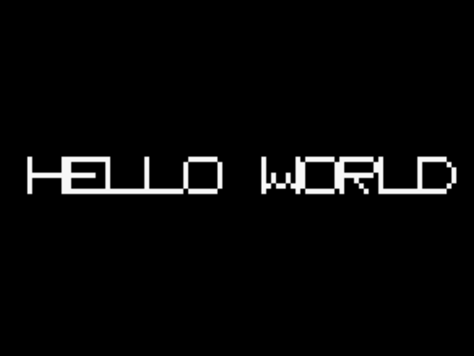

# Hello World (PlayStation 1)

A minimal, from-scratch bare-metal PS1 program (no PsyQ/PSn00bSDK
library calls). It talks directly to the GPU's two I/O ports to bring
up a 320x240 NTSC 15bpp display mode, then draws "HELLO WORLD" with the
GPU's monochrome-rectangle draw command, using the same hand-drawn 8x8
font used in the companion SNES/Dreamcast/N64 hello-world projects.



Booted and verified with [Mednafen](https://mednafen.github.io/), using
[OpenBIOS](https://github.com/grumpycoders/pcsx-redux/tree/main/src/mips/openbios)
(part of the PCSX-Redux project) as the BIOS -- an open-source (MIT
licensed), from-scratch reimplementation of the PS1 BIOS, written
specifically so homebrew doesn't need a real, copyrighted Sony BIOS
dump. No Sony code was sourced or used to build or run this.

## Layout

- `src/start.S` -- the MIPS entry point: sets up a stack pointer,
  calls `main()`.
- `src/hello.c` -- GPU setup (reset, NTSC 320x240 15bpp mode, display
  enable, drawing area/offset) and the font/draw code. The register
  addresses and command encodings were checked against OpenBIOS's own
  source (`common/hardware/{gpu,hwregs}.h`, `psyqo/primitives/
  rectangles.hh`, `main/splash.c`) rather than hand-derived from memory
  -- see the comment at the top of `hello.c` for specifics, including
  why the monochrome-rectangle command (`0x60`) was used instead of the
  GPU's "fast fill" command (`0x02`), which turned out to round
  coordinates to 16-pixel boundaries and would have mangled glyphs this
  small.
- `ps1.ld` -- linker script producing a PS-EXE: a 2048-byte header
  (entry point, load address, size, initial stack) followed by a flat
  code/data blob, loaded at the conventional `0x80010000`.
- `Makefile` -- builds `hello.exe` (a PS-EXE, despite the extension --
  this is the file's real conventional name in the PS1 homebrew scene)
  with the `mipsel-linux-gnu` cross toolchain (a real, little-endian
  MIPS I-capable GCC, even though its target triple says "linux" --
  this build never touches glibc; `-nostdlib -ffreestanding` plus our
  own `_start` make it a plain bare-metal codegen target, the same
  trick used for the Dreamcast and N64 projects' toolchains).
- `openbios.bin` -- a prebuilt copy of PCSX-Redux's OpenBIOS (see
  "Building OpenBIOS" below to rebuild it), for emulators that need a
  BIOS file path configured.
- `hello.bin` / `hello.cue` -- a bootable CD-XA disc image wrapping
  `hello.exe` (see "Building the ISO" below), for emulators/hardware
  that boot from a disc image rather than sideloading an executable
  directly.

## Building

Requires a little-endian MIPS cross toolchain (Ubuntu/Debian ship one):

```sh
sudo apt-get install gcc-mipsel-linux-gnu binutils-mipsel-linux-gnu
make
```

This produces `hello.exe`.

### Building OpenBIOS

`openbios.bin` here was built from PCSX-Redux's source, unmodified,
with the same cross toolchain (no need for their full documented
`mipsel-none-elf` toolchain -- the Makefile's `PREFIX`/`FORMAT`
variables just need overriding):

```sh
git clone https://github.com/grumpycoders/pcsx-redux.git
cd pcsx-redux
git submodule update --init --depth 1 -- third_party/uC-sdk
make -C src/mips/openbios PREFIX=mipsel-linux-gnu FORMAT=elf32-tradlittlemips
```

### Building the ISO

`hello.bin`/`hello.cue` were built from `hello.exe` with
[exe2iso](https://github.com/grumpycoders/pcsx-redux/tree/main/tools/exe2iso)
(part of PCSX-Redux, MIT/GPLv2 licensed), which writes a standards
-conformant single-file CD-XA image (`PSX.EXE;1` at the root, with
correct EDC/ECC on every raw 2352-byte sector) directly from a PS-EXE
-- no manually-authored ISO9660 tree or `SYSTEM.CNF` needed; the BIOS's
documented `PSX.EXE;1` fallback boot convention picks it up. It isn't
part of the pre-packaged `pcsx-redux` binary, but is a small,
self-contained host tool:

```sh
git clone https://github.com/grumpycoders/pcsx-redux.git
cd pcsx-redux
git submodule update --init --depth 1 -- third_party/fmt third_party/iec-60908b
g++ -std=c++20 -DFMT_HEADER_ONLY -I. -Isrc -Ithird_party -Ithird_party/fmt/include \
    tools/exe2iso/exe2iso.cc src/support/file.cc src/supportpsx/iso9660-builder.cc \
    third_party/iec-60908b/edcecc.c third_party/iec-60908b/tables.c \
    -o exe2iso
./exe2iso /path/to/hello.exe -o hello.bin
```

Then pair the `.bin` with a one-line `.cue`:

```
FILE "hello.bin" BINARY
  TRACK 01 MODE2/2352
    INDEX 01 00:00:00
```

## Running

- **Mednafen**: point its `psx.bios_na`/`psx.bios_jp`/`psx.bios_eu`
  setting (in `mednafen.cfg`, or `-psx.bios_na <path>` on the command
  line) at `openbios.bin`, set `psx.bios_sanity 0` (it isn't a genuine
  Sony BIOS, so its checksum won't match Mednafen's sanity check), then
  run `mednafen hello.exe` directly -- Mednafen loads a raw PS-EXE
  without needing a disc image.
- **PCSX-Redux**: ships with OpenBIOS built in; open `hello.exe`
  directly, or use its `BOOT_MODE=psexe` build option to skip straight
  to PS-EXE loading.
- **Real hardware**: PS-EXE is also what real BIOS's `Exec`/`LoadExec`
  kernel calls take (e.g. loaded over serial with a devkit/modchip, or
  from a memory card via an existing bootloader); real hardware needs
  the real BIOS, not `openbios.bin` (OpenBIOS targets emulators and
  flashable replacement chips, not sideloading onto stock firmware).
- **`hello.cue`/`hello.bin`** (the disc image, as opposed to sideloading
  `hello.exe`): should work anywhere that boots a normal PS1 disc image
  with OpenBIOS (or a real BIOS) configured -- PCSX-Redux itself is the
  best-tested combination, since OpenBIOS is developed and tested
  against it directly. See "Verification status" below for what was
  and wasn't confirmed here.

## Verification status

`hello.exe` (direct sideload) is fully verified -- see the screenshot
above, from Mednafen with `openbios.bin` as the configured BIOS.

`hello.cue`/`hello.bin` (the disc image) was *not* successfully booted
in this environment. Mednafen's own disc-format auto-detection doesn't
recognize the image at all without a `-license` file baked in by
`exe2iso` (its own README notes some emulators want one to recognize a
disc; a real Sony license image wasn't sourced, consistent with this
project's stance on not using copyrighted Sony content) -- passing
`-force_module psx` bypasses that detection and gets the disc loading
for real (OpenBIOS logs a real region/SCEx ID, no BIOS-sanity errors),
but it then never reaches this project's own code: the screen stays
black, at sustained ~87% CPU (i.e. actively running, not asleep or
crashed) for over a minute, well past how long `hello.exe` takes to
reach its first drawn frame directly. That points at OpenBIOS's own CD
shell/filesystem boot path hitting something Mednafen's CD-ROM/disc
emulation doesn't handle correctly, rather than a problem with
`hello.exe` itself (already proven working) or with the disc image
(built by `exe2iso`, the same tool the OpenBIOS project itself
documents as producing images that "boot in emulators, on real
hardware, and on ODEs"). PCSX-Redux -- OpenBIOS's own native/best-tested
emulator, not built in this environment because it needs SDL3, which
isn't packaged for this Ubuntu release -- or real hardware would be the
next things to try it on.

## How it works

- `_start` (`start.S`) points the stack near the top of PS1's 2MB main
  RAM, then calls `main()`. (The BIOS's PS-EXE loader already sets `$sp`
  from the header before jumping here, per the header's `s_addr` field
  -- this is just the same defensive "set it again explicitly" habit
  used in every other platform in this series.)
- `video_init()` issues GPU control-port (GP1) commands directly:
  reset, display area, horizontal/vertical timing range, 320x240 NTSC
  15bpp mode, then (after setting a full-screen drawing area/offset via
  the data port, GP0) enables the display.
- The screen is cleared to black and "HELLO WORLD" plotted into it,
  one monochrome rectangle per contiguous run of lit pixels in each
  font row, at 3x scale, centered.
- `main()` never returns; it spins forever once the frame is drawn.
