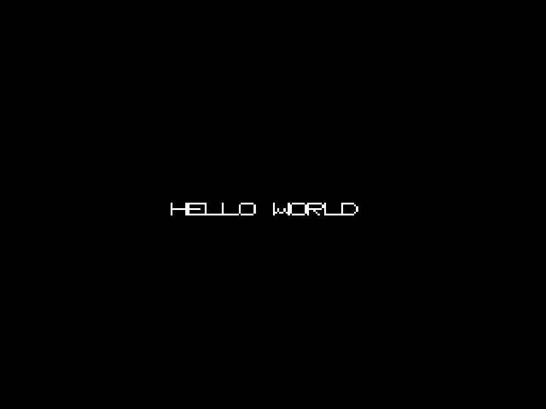

# Hello World (SNES)

A minimal, from-scratch Super Nintendo (SNES) program written in 65816
assembly. It sets up the PPU in BG Mode 0 with a hand-drawn 8-glyph 2bpp
font, draws a static tilemap spelling "HELLO WORLD", and turns the screen
on. No BIOS, no external font/graphics files, no libraries.



Verified running in [Snes9x](https://github.com/snes9x/snes9x) (via the
libretro core, headless in RetroArch) — the screenshot above is straight
from that run.

## Layout

- `src/hello.s` — the entire program: reset handler, PPU setup, font
  tile data, and tilemap, plus the SNES header and interrupt vector table.
- `snes-lorom.cfg` — `ld65` linker config describing the 32KB LoROM
  memory map (code, header at `$FFC0`, vectors at `$FFE0`).
- `tools/fix_checksum.py` — patches the header's checksum/complement
  fields after linking (the standard 16-bit-sum-of-all-bytes algorithm,
  valid because the ROM is an exact power-of-two size).
- `Makefile` — builds `hello.sfc` end to end.

## Building

Requires [cc65](https://cc65.github.io/) (`ca65`/`ld65`) and Python 3:

```sh
# Debian/Ubuntu
sudo apt-get install cc65

make
```

This produces `hello.sfc`, a 32KB LoROM ROM.

## Running

Load `hello.sfc` in any SNES emulator (Snes9x, bsnes, Mesen-S, RetroArch,
etc.) or on real hardware via a flash cart.

## How it works

- Boots into native (65816) mode, sets up the stack and data bank.
- Loads 8 glyph tiles (`H E L O <space> W R D`, 2bpp, 16 bytes each) to
  VRAM word address `$0000`.
- Loads a 32x32 tilemap to VRAM word address `$0400`, with the string
  "HELLO WORLD" placed at row 14, column 10, and blank tiles everywhere
  else.
- Sets CGRAM color 0 to black (backdrop) and color 1 to white (glyph
  ink).
- Configures BG Mode 0, BG1's map/tile base addresses, enables BG1 on
  the main screen, and turns off forced blank.
- Halts in an infinite loop — nothing needs to change after that, so no
  NMI/IRQ handling is required.
